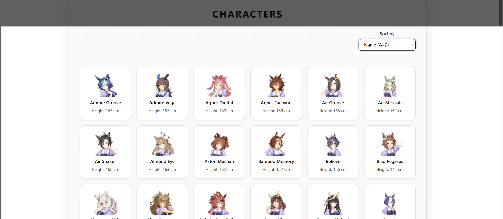
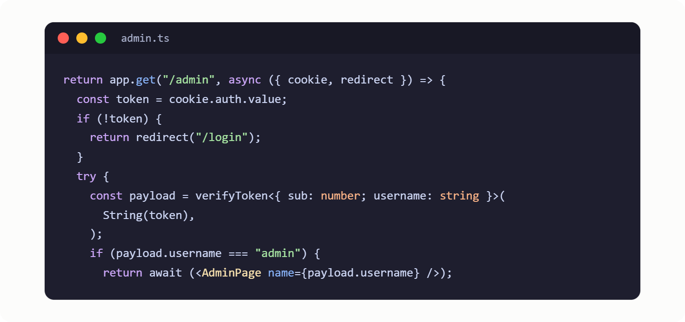
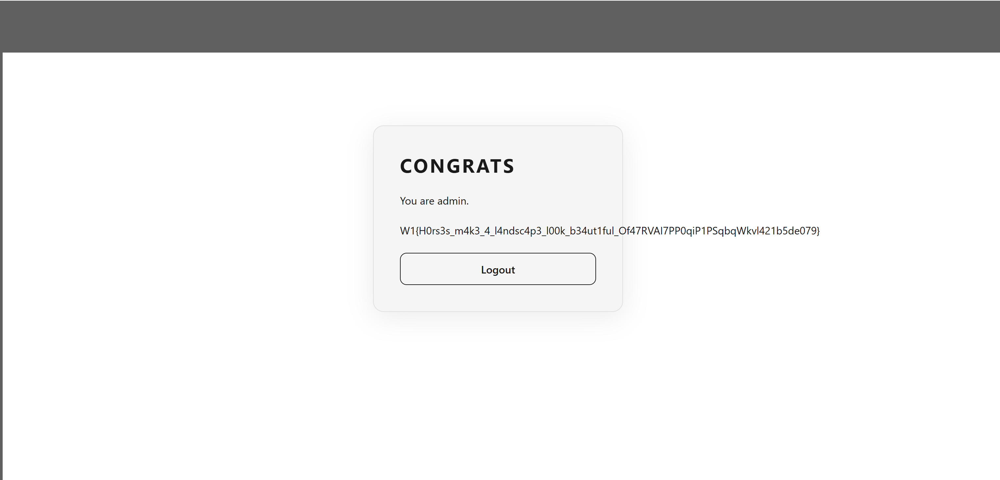
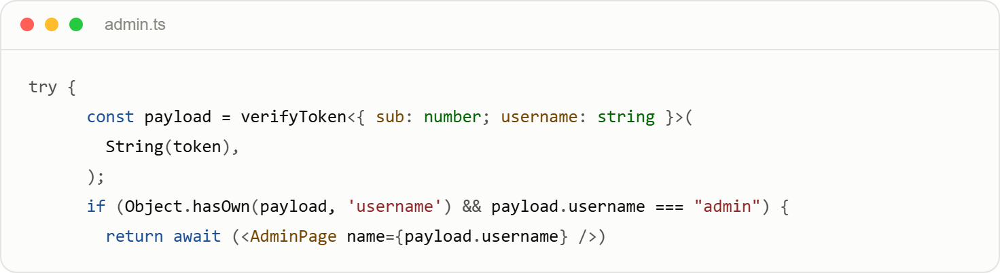
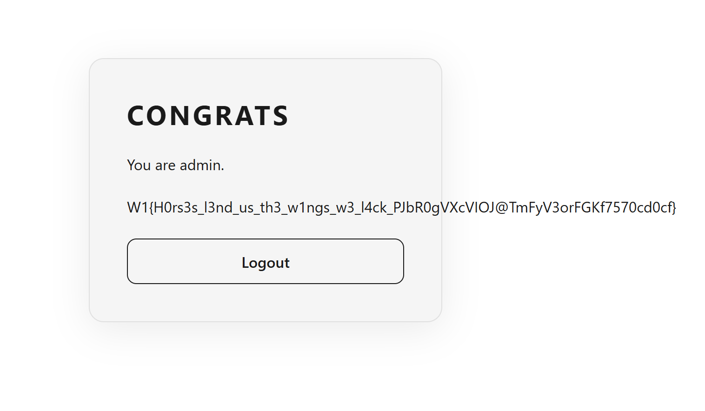

Write up

Overview

Hachimi

Hachimi-revenge

**Hachimi**

Mở đầu ta nhận được 1 link web đến target server và file hachimi.zip bên
trong chứa source code. Web server có 2 trường login và register , ta
tiến hành tạo tài khoảng và login vào bên trong.
{width="6.5in" height="2.834722222222222in"}

Đây là UI của web challenge , thấy không tương tác được gì nhiều , open
đại 1 image để xem url :
<http://45.122.249.68:10393/public/images/admiregroove_icon75.jpg>

Ta kiểm tra xem đường dẫn có bị path traversal không thì không thấy. Như
vậy đã hết endpoint bên trong nên sẽ xem source code thử. Khi đọc source
ta thấy có trang admin.tsx khả năng cao có thông tin ngon liên quan đến
admin

{width="6.5in" height="3.064583333333333in"}

Ở đây ta thấy để vào Adminpage cần truy cập vào /admin với
username==admin , có verify bằng token nhưng nếu username==admin thì qua
được , nên sẽ thử đăng kí username=admin ( nếu username này chưa tồn tại
thì thành công ) ,và thành công
thật{width="6.5in" height="3.1256944444444446in"}

**Hachimi-revenge**

Đề khá giống lúc nãy ,vẫn có source code, khi vào thấy giao diện giống
hệt , linh cảm mách bảo sẽ có sự thay đổi ở chỗ code lỗi lúc nãy
(admin.ts)

{width="6.5in" height="1.775in"}

Ta nhận thấy có thể vào /get như ở challenge trước nếu kiểm soát được
username==admin , vậy ta lại thử tạo tài khoản có username là admin để
access vào , và vẫn thành công. {width="6.5in"
height="3.790277777777778in"}
